<!-- pdf_document -->
<!-- rmarkdown::html_vignette -->

```{r, include = FALSE}
knitr::opts_chunk$set(
  collapse = TRUE,
  comment = "#>"
)
```

```{r, echo = FALSE, comment="", prompt=TRUE}
cat(format(Sys.time(), "%B %d, %Y"))
```

## Introduction

Alberta Environment and Parks is piloting using remote game cameras to monitor the herd composition of wood bison. 
Three R packages have been developed to work together to achieve this goal. 
The underlying functionality is in [`bisonpictools`](https://github.com/poissonconsulting/bisonpictools) which has functions to clean and process data, model, and visualize data.
The two apps which are built as R packages which are a user friendly interface to [`bisonpictools`](https://github.com/poissonconsulting/bisonpictools). 
The first app is [`shinybisonpic`](https://github.com/poissonconsulting/shinybisonpic) which allows users to explore the data by viewing the locations of cameras and the ratios of various sex-age groups. 
The second app is [`runbisonpic`](https://github.com/poissonconsulting/runbisonpic) which allows users to run a model to see the abundance class, abundance total, survival, fecundity, and various sex-age ratios. 

## User Interface Overview

```{r out.width = '100%', echo = FALSE}
knitr::include_graphics("images/app-overview.png")
```
*<font size="-1">Figure 1. General layout of the apps.</font>*

- To navigate between tabs, click on a new tab. 
- To access the instructions for the tab, click the help button (question mark).

## shinybisonpic

### Getting Started

shinybisonpic is an online application.

To access the app, open a web browser and go to  [https://poissonconsulting.shinyapps.io/shinybisonpic-dev/](https://poissonconsulting.shinyapps.io/shinybisonpic-dev/)

### Overview

1. Download template, fill in data and upload file
2. View locations on the landscape
3. Explore sex-age ratios

The only required order of this app is to upload the data first and then either the locations or ratios can be explored next. 

### Detailed Steps

#### Data Upload

&nbsp;
```{r out.width = '100%', echo = FALSE}
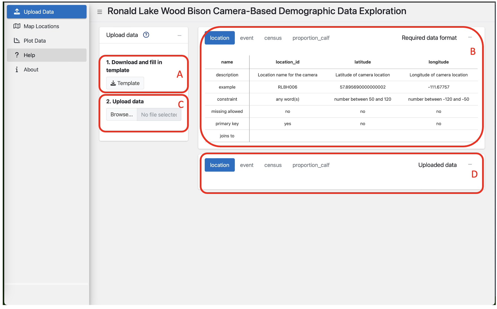
```
*<font size="-1">Figure 2. Data upload tab and opening screen of app.</font>*

When the app launches successfully you will see the data upload tab. 

Data must be first uploaded in the Upload Data tab for the Map Locations and Plot Data tabs to work. 

##### 1. Download and fill in template

- **(A)** Click the **Download Template** button to download an excel template.
- Locate the template file that was downloaded.
- **(B)** Enter data into the template by following the rules of the Required data format (box in the top right of Upload Data tab).
  - Required data format box:
    - **name**: Name of the column.
    - **description**: Description of the column.
    - **example**: Example value for the column.
    - **constraint**: The type and allowed range of values for the column.
    - **missing allowed**: Whether missing values are allowed in the column. Missing values are represented by blank cells in the spreadsheet.
    - **primary key**: Column(s) that make up the primary key for the table, this is the set of columns that make the row unique.
    - **joins to**: The name of the table the column joins to.
      - The value must appear in the parent table for it to be allowed in the child table.
      - For example, a location_id of `LOCID11` must be in the location table to be allowed in the event table.
- It is recommended to copy/move your data into the template file instead of formatting your data file to look like the template.
- Be careful when working with text values like sheet names, column names, or text-based values as the values must match identically meaning they are case and space sensitive.
- The data will not be accepted to the app unless the Required data format is followed.

##### 2. Upload data

 - **(C)** Click the **Browse…** button and select a file
  - If the data does not follow the Required data format a pop-up box will appear with a message indicating which rules were not followed. The data has not been successfully uploaded to the app.
  
```{r out.width = '100%', echo = FALSE}
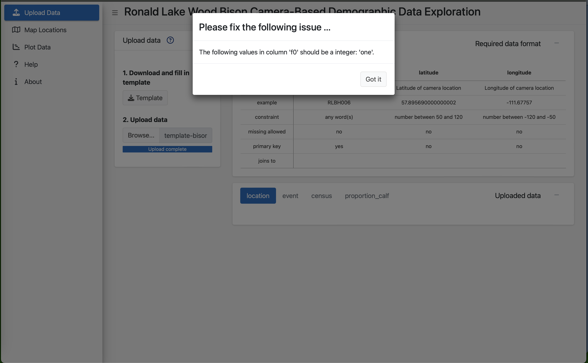
```
*<font size="-1">Figure 3. Example of when the data upload failed due to not following the Required data format, the data must be corrected and uploaded again. In this case the upload failed because the word "one" was written in the f0 column when the f0 column only accepts integers between 0 and 900, the user needs to change the value from "one" to "1" and then upload the file again.</font>*
 
 - Close the pop-up box by clicking **Got it**.
 - Correct the error in the excel template.
 - Upload the corrected data.
 - Repeat until no more errors are detected.
   - The app is only able to detect one error at a time so this process may take several iterations as you work through various issues.
 
 - **(D)** When the file is successfully uploaded it will appear in the Uploaded data box.
 
```{r out.width = '100%', echo = FALSE}
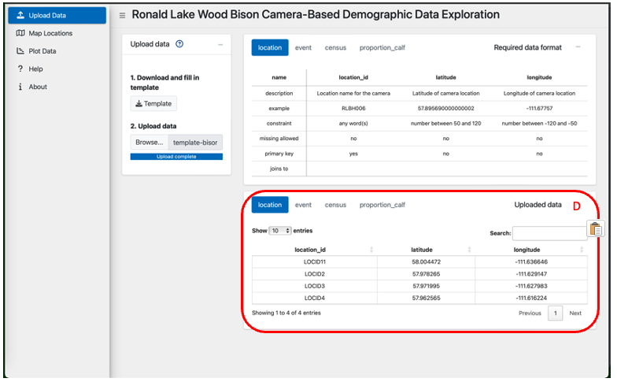
```
*<font size="-1">Figure 4. Data upload is successful.</font>*

- Review the data in the Uploaded data box for errors or issues before continuing onto the next tab.
  - You can: 
    - Increase the number of entries you can see in the table by changing the value in **Show entries**.
    - Sort by the column by clicking on the column name.
    - Search for values by typing in the **Search:** field.

#### Map Locations

&nbsp;

```{r out.width = '100%', echo = FALSE}
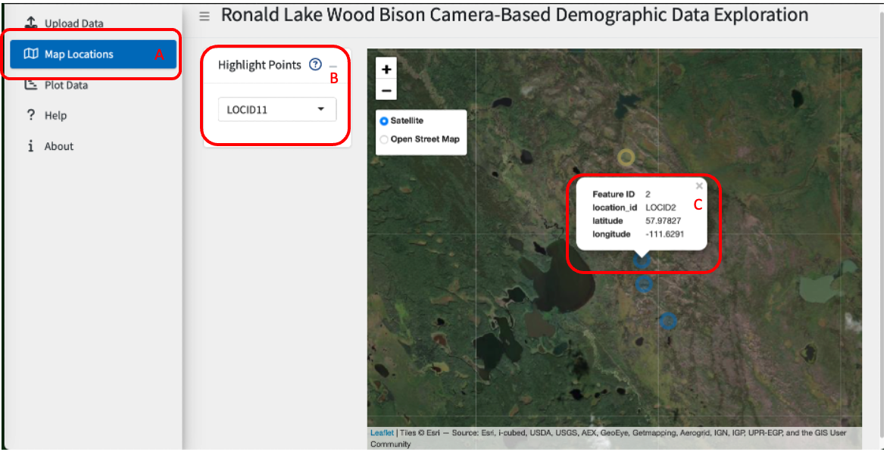
```
*<font size="-1">Figure 5. Example of the Map Locations tab showing the points on the map with location LOCID11 highlighted as its selected in the drop-down and location LOCID2 clicked on to show a pop-up with the specific details about the location.</font>*

The location_id’s from the location table will be displayed on the map.

Data must first be uploaded through the Upload Data tab for data to be displayed on this tab. 

**Usage**

- **(A)** Select the Map Locations tab.
- **(B)** Select a location from the drop-down menu to highlight it.
- **(C)** Click on a point to show the name, latitude, and longitude.

There is no order to the **(B)** or **(C)**, so these steps can be done in any order or at any time once data has been uploaded into the app. 

**Map Features**

- Use your mouse or arrow keys to move around the map.
- Use the +/- buttons at the top left of the map or scroll with your mouse to zoom in and out.
- Select the map type at top left of the map underneath the +/- buttons to switch between map types.

**Troubleshooting**

- No points on the map.
  - Check that you have uploaded a data set in the Upload Data tab.
  - Check that the latitude and longitude columns in the location table have values.
  - Check that the coordinates are in decimal degrees.
  - Zoom out to see if the points are somewhere else in the world.
- Drop down-field is empty.
  - Make sure you have uploaded a data set in the Upload Data tab.
  - Check that the location_id column in the location table has values.
- Map is frozen.
  - Refresh your browser and upload the data again.

#### Plot Data

&nbsp;

```{r out.width = '100%', echo = FALSE}
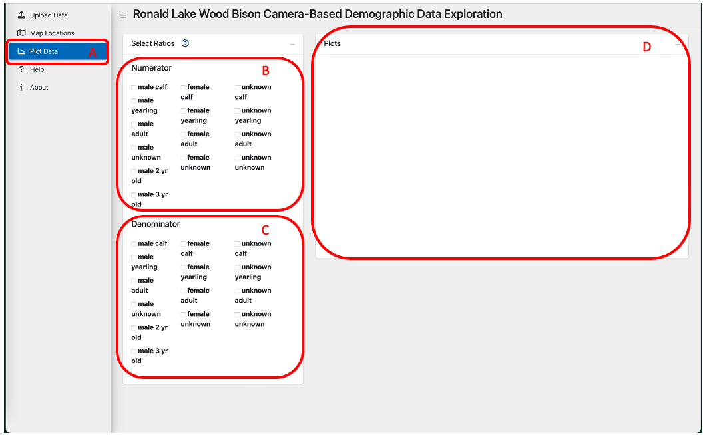
```
*<font size="-1">Figure 6. Plot Data tab with no variables selected.</font>*

Explore the ratios numerator:(denominator + numerator) of various sex-age groups by selecting any combinations of values.

Data must first be uploaded through the Upload Data tab for data to be displayed on this tab. 

**Usage**

- **(A)** Select the Plot Data tab.
- **(B)** Select at least one value for the Numerator.
- **(C)** Select at least one value for the Denominator.
- **(D)** At least one value for both the Numerator and Denominator has to be selected for the plot to appear. 

```{r out.width = '100%', echo = FALSE}
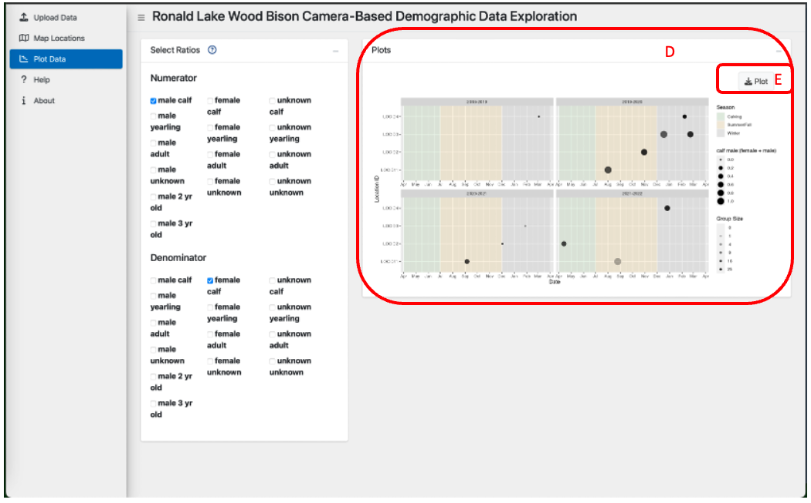
```
*<font size="-1">Figure 7. Example showing male calf selected for the Numerator and female calf selected for the Denominator. Since a value is ticked in both the Numerator and Denominator sections the plot has appeared.</font>*

- **(E)** Click the **Download Plot** button to get a PNG file of the plot
  - The plot will have a title that lists which values were ticked for the numerator and denominator
  - The download button is only visible when a plot is rendered

- The plot is dynamic and will update when new boxes are ticked in either the Numerator or Denominator sections. Values can be ticked on and off as needed.

**Troubleshooting**

- No plot is appearing.
  - Make sure at least one value is selected in the Numerator and Denominator section.
  - Confirm that a data set was successfully in the Upload Data tab.

### How to Report Issues 

To report a bug or issue with the app, you must submit an [Issue](https://github.com/poissonconsulting/shinybisonpic/issues) through GitHub. 

If the issue is critical and time sensitive then submit the Issue and contact the creator (maintainer) who is listed in the [DESCRIPTION file](https://github.com/poissonconsulting/shinybisonpic/blob/main/DESCRIPTION). 

New features or enhancements can also be requested through submitting an [Issue](https://github.com/poissonconsulting/shinybisonpic/issues). 

## runbisonpic

### Getting Started 

This app must be launched locally from your laptop. 

1. Open the runbisonpic project in RStudio
2. There are two different ways the app can be launched:

   - Run *app.R* script by opening the file and running the two lines of code or

```{r out.width = '100%', echo = FALSE}
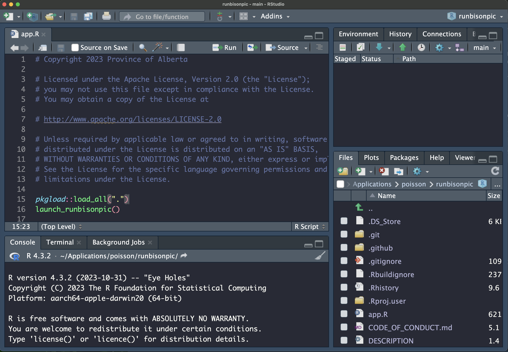
```
*<font size="-1">Figure 8. How to launch runbisonpic using code.</font>*
  
   - Going to the Addins button and selecting **Start runbisonpic app**
   
```{r out.width = '100%', echo = FALSE}
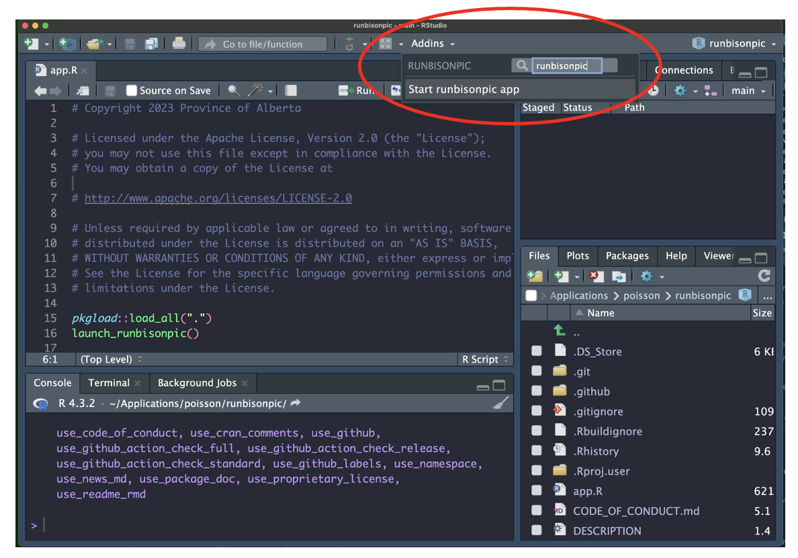
```   
*<font size="-1">Figure 9. How to launch runbisonpic using the Addins button.</font>*

### Overview

1. Download template, fill in data and upload file.
2. Run model.
3. Explore the results.

The order of steps are required to be followed in this app, first data must be uploaded, second the model run and finally the results can be explored.  

### Detailed Steps 

#### Data Upload

&nbsp;

```{r out.width = '100%', echo = FALSE}
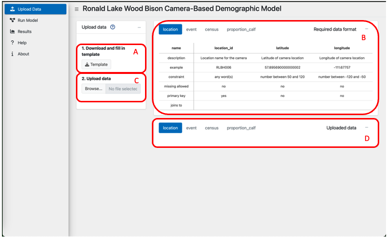
```
*<font size="-1">Figure 10. Data upload tab and opening screen of app.</font>*

When the app launches successfully you will see this page. 

Data must be first uploaded in the Upload Data tab for the Run Model tab to work.

##### 1. Download and fill in template

- **(A)** Click the **Download Template** button to download an excel template.
- Locate the template file that was downloaded.
- **(B)** Enter data into the template by following the rules of the Required data format (box in the top right of Upload Data tab).
  - Required data format box:
    - **name**: Name of the column.
    - **description**: Description of the column.
    - **example**: Example value for the column.
    - **constraint**: The type and allowed range of values for the column.
    - **missing allowed**: Whether missing values are allowed in the column. Missing values are represented by blank cells in the spreadsheet.
    - **primary key**: Column(s) that make up the primary key for the table, this is the set of columns that make the row unique.
    - **joins to**: The name of the table the column joins to.
      - The value must appear in the parent table for it to be allowed in the child table.
      - For example, a location_id of `LOCID11` must be in the location table to be allowed in the event table.
- It is recommended to copy/move your data into the template file instead of formatting your data file to look like the template.
- Be careful when working with text values like sheet names, column names, or text-based values as the values must match identically meaning they are case and space sensitive.
- The data will not be accepted to the app unless the Required data format is followed.

##### 2. Upload data

 - **(C)** Click the **Browse…** button and select a file
   - If the data does not follow the Required data format a pop-up box will appear with a message indicating which rules were not followed. The data has not been successfully uploaded to the app.
  
```{r out.width = '100%', echo = FALSE}
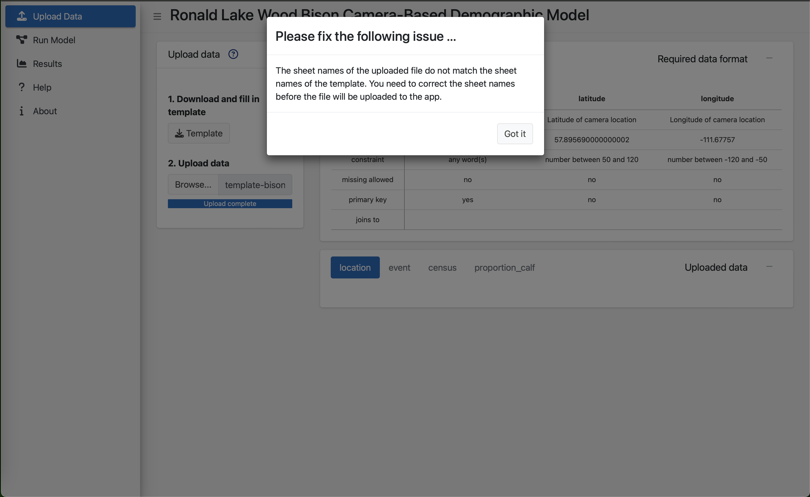
```
*<font size="-1">Figure 11. Example of when the data upload failed due to not following the Required data format, the data must be corrected and uploaded again. In this case the upload failed because the name of the sheet in the excel file was changed from the template, the user needs to update this and then upload the file again.</font>*
 
 - Close the pop-up box by clicking **Got it**.
 - Correct the error in the excel template.
 - Upload the corrected data.
 - Repeat until no more errors are detected.
   - The app is only able to detect one error at a time so this process may take several iterations as you work through various issues
 
 - **(D)** When the file is successfully uploaded it will appear in the Uploaded data box.
 
```{r out.width = '100%', echo = FALSE}
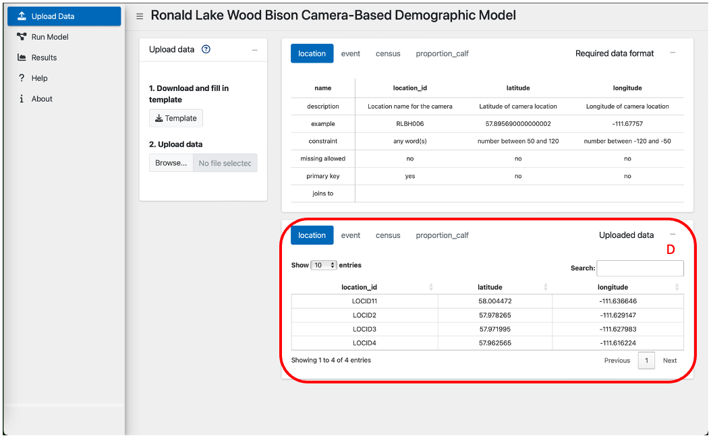
```
*<font size="-1">Figure 12. Data upload is successful.</font>*

- Review the data in the Uploaded data box for errors or issues before continuing onto the next tab.
  - You can: 
    - Increase the number of entries you can see in the table by changing the value in **Show entries**.
    - Sort by the column by clicking on the column name.
    - Search for values by typing in the **Search:** field.

#### Run Model

&nbsp;

```{r out.width = '100%', echo = FALSE}
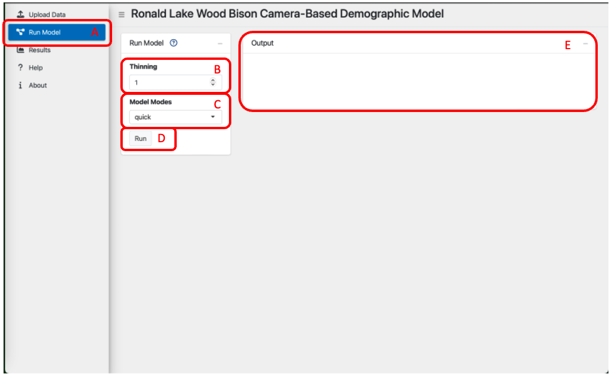
```
*<font size="-1">Figure 13. Model tab before the Run button is pressed.</font>*

**Usage** 

- **(A)** Select the Run Model tab. 
- **(B)** Select the thinning.
- **(C)** Select the model mode.
- **(D)** Press the run button.
   - Model may take over 24 hours to run, be patient. 
   - **(E)** The run is complete when the Outbox is populated with a table.
   - If there is an issue a pop-up box will appear indicating something is not valid, this must be fixed, and the run button will need to be pressed again to restart the model run.
   - The app has crashed and needs to be restarted if any of the following occur:
      - The screen goes grey. 
      - A box appears in the bottom left corner saying disconnected.
      - An error message appears in the Console of RStudio.

```{r out.width = '100%', echo = FALSE}
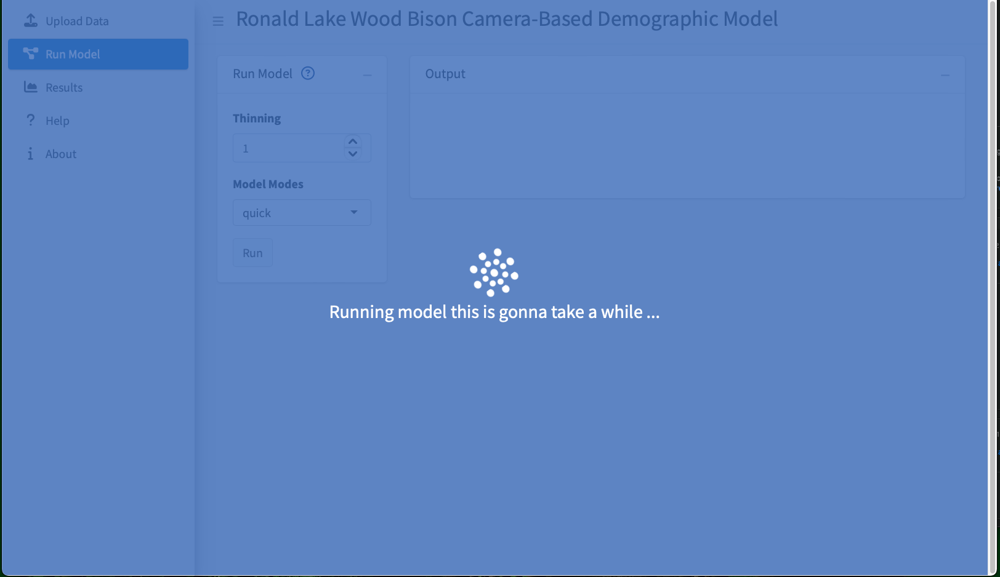
```
*<font size="-1">Figure 14. Model tab when the model is running. Users must wait until this screen is gone to continue.</font>*

&nbsp;

```{r out.width = '100%', echo = FALSE}
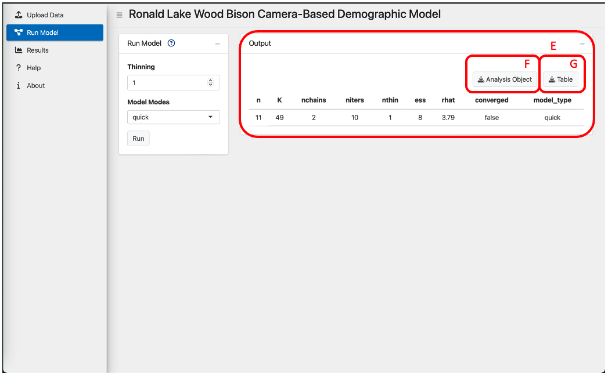
```
*<font size="-1">Figure 15. Model tab after a successful run of the model.</font>*

- **(F)** Download the Analysis Object as an RDS file. 
  - This allows more advanced users to use the output of the model to generate their customized results. 
- **(G)** Download the model run details as an csv file. 

#### Parameters    

&nbsp;

**Thinning**

- Allowed values are an integer between 1 and 10000.
- Increase thinning if the model does not converge.
  - The model did not converge if the converged value is `FALSE`. 
- As the thinning value increases the run time will also increase. 
  - Start with a small thinning value and increase as needed. 
  - Thinning is often increased by various values try 1, 50, 100, 200, 500, 1000, etc.

**Model Mode**

There are three model modes:

- quick
  - For testing the models runs.
  - Model results won’t be accurate, but this mode is helpful when first running the model to ensure everything is running correctly.
  - Run includes 2 chains and 10 iterations. 
- report 
  - This is a full run of the model. 
  - This mode will take much longer than quick mode. 
  - Run includes 3 chains and 500 iterations.
- debug
  - Verbose output for debugging.
  - Use this mode if errors are occurring and more help is needed.
  - Read the messages printed to the Console of RStudio to determine what is going on. 
  - Run includes 2 chains and 10 iterations. 

#### Description of Output Table

&nbsp;

**n**

- Sample size.

**K**

- Number of parameter terms in the model.

**nchains**

- The number of chains.

**niters**

- Number of iterations. 
- A count of the number of simulations to save per chain.

**nthin**

- How much the chains should be thinned out before storing them.
  - Setting nthin = 1 corresponds to keeping all values.
  - A value of nthin = 100 would result in keeping every 100th value and discarding all other values.

**ess**

- Effective sample size (ess).
- The number of independent samples with the same estimation power as the n autocorrelated samples.
- Measure of how much independent information there is in autocorrelated chains.
- Doubling the thinning rate doubles the ess.

**rhat**

- A ratio of variances that compares the between- and within-chain estimates for model parameters.
- Evaluates whether the chains agreed on the same values.
- As the total variance of all the chains shrinks to the average variance within chains, r-hat approaches 1 (close to 1 is ideal).

**converged**

- Whether or not the model converged. 
  - Determines whether the model chains agreed on the same values.
- TRUE
  - This indicates the model converged.
  - A model must converge for the results to considered accurate. 
- FALSE
  - This indicates the model did not converge.
  - The model should be run again with different parameters or more data until the model converges.
  - Results may not be accurate if the model did not converge.

#### Download Options    

&nbsp;

After a successful run of the model two download buttons will appear in the top left of the Output box.

- Analysis Object
  - Download the output of the model run as a rds file.
  - This allows users to use the output of the model after the app closes.
- Table
  - Download the output table as a .csv file.  

#### Helpful Tips

- If you set the thinning to 1 and model mode to quick you can get a quick run of the model. This can help to make sure there are no issues with the data before doing a report run that may take a day or more to run. 

#### Results

&nbsp;

```{r out.width = '100%', echo = FALSE}
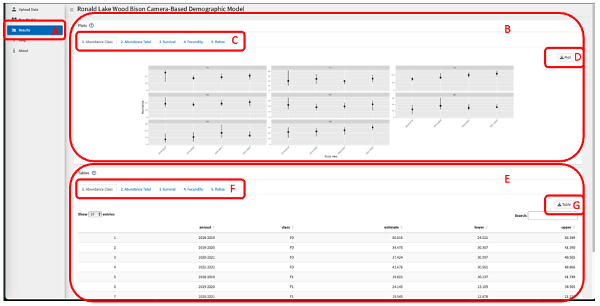
```
*<font size="-1">Figure 16. Results of the model run.</font>*

**Usage**

- **(A)** Select the Results tab. 
- **(B)** Explore the Plots.
- **(C)** Select a plot.
- **(D)** Download a png of the plot.
- **(E)** Explore the Tables.
- **(F)** Select a table.
- **(G)** Download a csv of the table.

**Results**

- Abundance Class
  - Predicts abundances of each class for each study year.
- Abundance Total
  - Predicts the total herd abundance for each study year, as the sum of the predicted abundances for each class.
- Survival
  - Predicts the survival rates for each class for each study year. Bull survival corresponds to the M2, M3, and MA classes.
- Fecundity
  - Predicts the fecundity rate and proportion of reproductive cows.
- Ratios
  - Predicts the following ratios for each study year: M0:F0, M1:F1, Calf:FA, Yearling:FA, M2:FA, M3:FA, MA:FA.

**Table Features**

- You can use the search bar to search and filter the table to specific values. 
- The number of rows displayed can be adjusted by changing the number in the Show drop down. 
- To view more rows of data you can click the Next or Previous buttons at the bottom of the table.

**Troubleshooting**

- Plots
  - If the plots are not appearing, confirm that the model was successfully run.
  - Adjusting the zoom/view in the browser will change how the plots display, if you are finding the text on the plot too small try zooming in. This can be done through the browser view settings and selecting zoom in or by the keyboard shortcut *ctlr +* (or *command +* on a Mac).
  - Please give the plots time to generate, it may take up to a minute or longer.
  - The download button will only become visible once the plot is generated.
  - Plots can only be downloaded individually, there is no way to download all the plots at once.  

- Tables
  - If the tables are not appearing, confirm that the model was successfully run. 
  - Please give the tables time to generate, it may take up to a minute or longer. 
  - The download button will only become visible once the table is generated. 
  - Tables can only be downloaded individually, there is no way to download all the tables at once. 

### How to Report Issues 

To report a bug or issue with the app, you must submit an [Issue](https://github.com/poissonconsulting/runbisonpic/issues) through GitHub. 

If the issue is critical and time sensitive then submit the Issue and contact the creator (maintainer) who is listed in the [DESCRIPTION file](https://github.com/poissonconsulting/runbisonpic/blob/main/DESCRIPTION). 

New features or enhancements can also be requested through submitting an [Issue](https://github.com/poissonconsulting/runbisonpic/issues).  

## Disclaimer

The shinybisonpic and runbisonpic apps are designed to function optimally when used in accordance with the instructions provided in the user manual. Users are strongly advised to follow the guidelines outlined in the manual for the best and intended experience.

Users are responsible for:

1. Adherence to user manual.
2. Ensure they are using the most up to date verison of the software. 

In the event that users do not adhere to the guidelines specified in the user manual, there is no guarantee that the apps will function. Users may experience unexpected behavior, errors, or issues that could impact their experience.

The apps have been built a specific purpose if they are used for other purposes they may not function as expected. 

There are hyperlinks embedded in the text of the User Guide, if the document is printed the hyperlinks will not be visible. 

## Troubleshooting and Known Issues 

- If it appears the app has frozen or is not responding, try restarting your browser. 
- Different browsers may display information differently, try a different browser if the app is not working. 
- R shiny applications can take some time to generate results, ensure you have waited enough time before restarting.

## Updates and Release Notes

To read about the most recent updates go to the NEWS.md file of each package:

- [bisonpictools](https://github.com/poissonconsulting/bisonpictools/blob/main/NEWS.md)
- [shinybisonpic](https://github.com/poissonconsulting/shinybisonpic/blob/main/NEWS.md)
- [runbisonpic](https://github.com/poissonconsulting/runbisonpic/blob/main/NEWS.md)

## Version

```{r, echo = FALSE, comment="", prompt=TRUE}
cat(R.Version()$version.string)

cat(paste("shinybisonpic:", packageVersion("shinybisonpic")))

cat(paste("runbisonpic:", packageVersion("runbisonpic")))

cat(paste("bisonpictools:", packageVersion("bisonpictools")))
```
