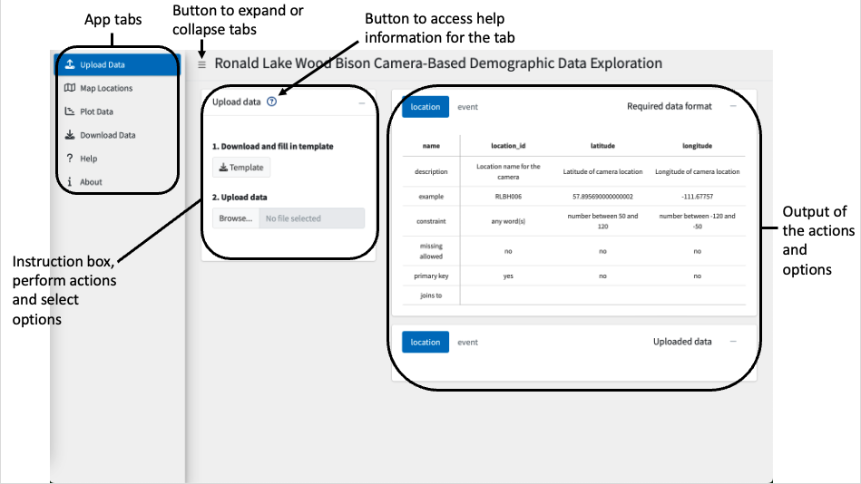
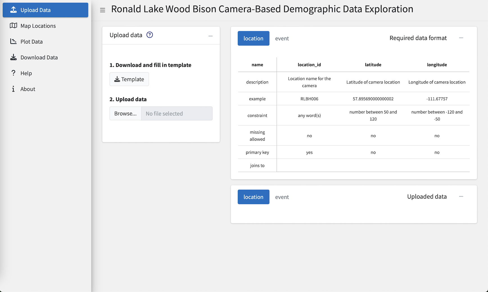
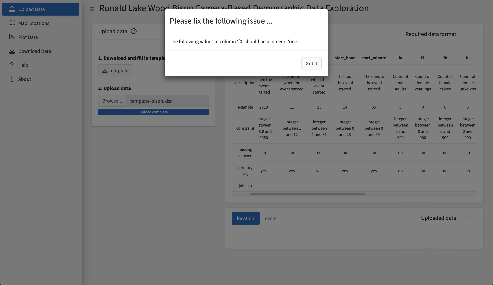
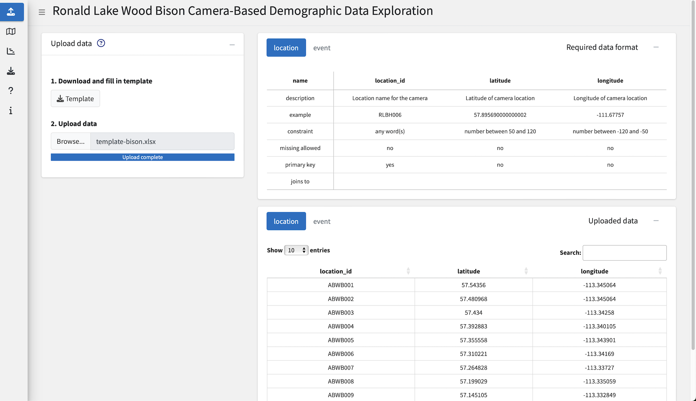
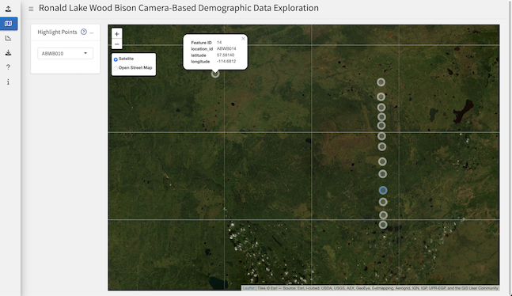
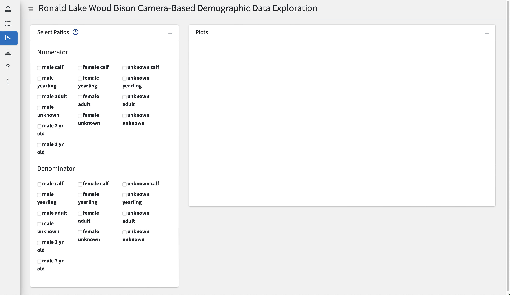
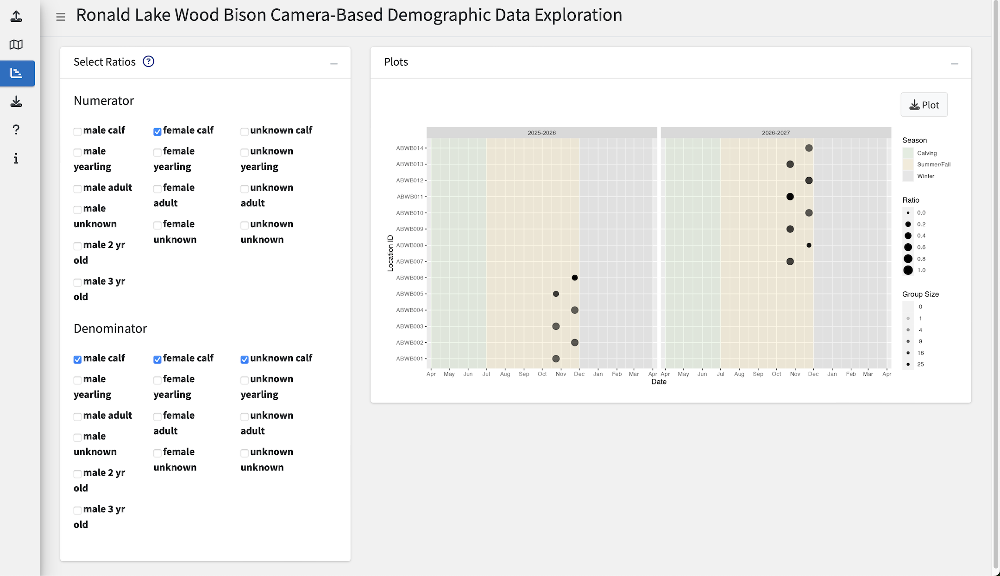
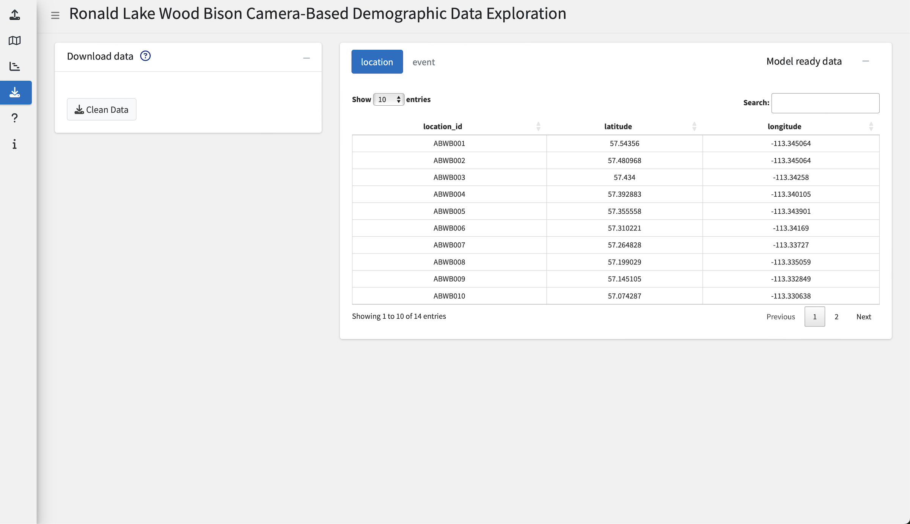

```{r, include = FALSE}
knitr::opts_chunk$set(
  collapse = TRUE,
  comment = "#>"
)
```
<!-- Update date when changes are made -->
August 30, 2023

shinybisonpic is an online application that allows users to upload, view, and process their camera trap count data. 

## Starting shinybisonpic

To access the app, open a web browser and go to  [https://poissonconsulting.shinyapps.io/shinybisonpic-dev/](https://poissonconsulting.shinyapps.io/shinybisonpic-dev/)

## Layout

```{r out.width = '100%', echo = FALSE}

```
*<font size="-1">Figure x. General layout of each tab.</font>*

## Steps

### Tab 1. Data Upload

```{r out.width = '100%', echo = FALSE}

```
*<font size="-1">Figure x. Data upload tab and opening screen of app.</font>*

When the app launches successfully you will see this page. 

#### 1. Download and fill in template

- Click the **Download Template** button
- Open the excel file that was downloaded to your computer
  - The file name will be *template-bison.xlsx*
- Enter data into the template file following the rules of the Required data format (box at the top right of the page)
  - Description of the rows in the Required data format box:
    - name: name of the column
    - description: description of the column
    - example: example value for the column
    - constraint: the type and allowed range of values for the column
    - missing allowed: whether missing values are allowed in the column. Missing values are blank cells in the spreadsheet
    - primary key: columns that make up the primary key for the table, this is the set of columns that make the row unique
    - joins to: the name of the table the column joins to
      - the value must appear in the parent table for it to be allowed in the child table
      - for example a location_id of `ABWB001` must be in the location table to be allowed in the event table
  - Copy/move your data into the template file instead of formatting your data file to look like the template
  - Be careful working with text values like sheet names, column names, or text based values as the values must match identically meaning they are case and space sensitive
- Review data 
  - the data will not be accepted to the app unless the Required data format is followed

#### 2. Upload data

 - Click the **Browse…** button and select a file
  - If the file is not successfully uploaded a pop up box will appear with a message indicating which rules of the Required data format were not followed 
```{r out.width = '100%', echo = FALSE}

```
*<font size="-1">Figure x. Data upload failed due to not following the Required data format, the data must be corrected and uploaded again. The upload failed because the word "one" was written in the f0 column when the f0 column only accepts integers between 0 and 900, the user needs to change the value from "one" to "1" and then upload the file again.</font>*
 
 - Close the pop up box by clicking **Got it**
 - Correct the error 
 - Upload the corrected data
 - Repeat until no more errors are detected
   - The app is only able to detect one error at a time so this process may take several iterations as you work through various issues
 
 - When the file is successfully uploaded it will appear in the Uploaded data box 
```{r out.width = '100%', echo = FALSE}

```
*<font size="-1">Figure x. Data upload is successful.</font>*

- Review the data in the Uploaded data box for errors or issues before continuing onto the next tab
  - You can: 
    - Increase the number of entries you can see in the table by changing the value in **Show entries**
    - Sort by the column by clicking on the column name
    - Search for values by typing in the **Search:** field 

### Tab 2. Map Locations

```{r out.width = '100%', echo = FALSE}

```
*<font size="-1">Figure x. Map Location tab showing the points on the map with location ABWB010 highlighted as its selected in the drop-down and location ABWB014 clicked on to show a pop-up with the specific details about the location.</font>*

The location_id’s from the location table will be displayed on the map.

#### 1. Explore camera locations on a map

- Select a location from the drop-down menu to highlight it
- Click on a point to show the name, latitude and longitude

**Map Features**

- Use your mouse or arrow keys to move around the map
- Use the +/- buttons at the top left of the map or scroll with your mouse to zoom in and out
- Select the map type at top left of the map underneath the +/- buttons to switch between map types

**Trouble Shooting**

- No points on the map
  - Check that you have uploaded a data set in the Upload Data tab.
  - Check that the latitude and longitude columns in the location table have values populated.
  - Check that the coordinates are decimal degree latitude and longitude values.
  - Zoom out to see if the points are somewhere else in the world.
- Drop down-field is empty
  - Make sure you have uploaded a data set in the Upload Data tab.
  - Check that the location_id column in the location table has values populated.
- Map is frozen
  - Refresh your browser and upload the data again.

### Tab 3. Plot Data

```{r out.width = '100%', echo = FALSE}

```
*<font size="-1">Figure x. Plot Data tab with no variables selected.</font>*

Explore the ratios of various sex-age groups by selecting any combinations of values.

For the plot to appear, you must:

- select at least one value for the Numerator
- select at least one value for the Denominator

#### 1. Select values for the Numerator

- Tick at least one sex-age group
```{r out.width = '100%', echo = FALSE}

```
*<font size="-1">Figure x. Shows female calf selected for the the Numerator.</font>*

#### 2. Select values for the Denominator

- Tick at least one sex-age group
- A plot will start to appear as soon as a box is ticked in the Denominator (assuming boxes are already ticked in the Numerator section)
- Wait a second after you have ticked all the boxes to let the plot render
```{r out.width = '100%', echo = FALSE}

```
*<font size="-1">Figure x. Shows male calf, female calf and unknown calf selected for the Denominator. Since both the Numerator and Denominator have values selected the plot is displayed. This will plot female calves against all calves.</font>*

#### 3. Download the plot

- Click the **Download Plot** button to get a PNG file of the plot
  - The file name will be *shinybisonpic_ratio_plot.png*
- The plot will have a title that lists which values were ticked for the numerator and denominator
- The download button is only visible when a plot is rendered

### Tab 4. Download Data

```{r out.width = '100%', echo = FALSE}

```
*<font size="-1">Figure x. Download Data tab showing processed data in the Model ready data box.</font>*

Get data that is ready to be feed into the modeling app.

#### 1. Download the processed data

- Review the data in the Model ready data box
- Click **Download Clean Data** button to get an excel file
  - The file name will have the format *YYYY-MM-DD_HH-MM-SS_bison_data.xlsx*

### Next Steps in Modeling App

#### TO DO
